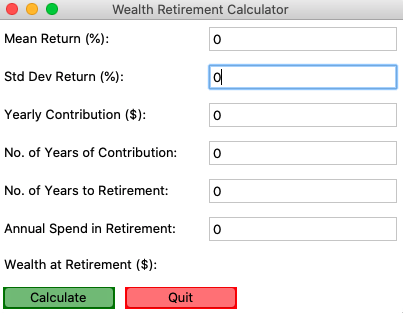
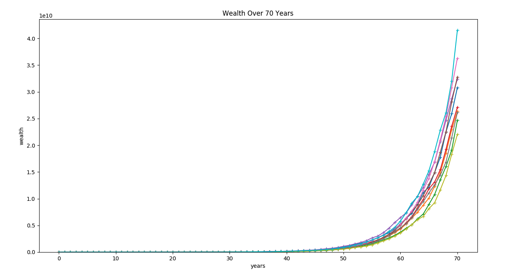

# Retirement savings calculator :dollar:
======================
> A Python based GUI to plan your future

:star: Star me on GitHub — it helps!

## Table of content

- [Background](#background)
- [Installation](#installation)
- [Result](#solution)
- [License](#license)
- [Links](#links)

## Background




## Installation
> This project uses Scipy as it's primary library to solve Machine Learning tasks. 
### Installing via pip
You can install packages via the command line by entering:
```bash
python -m pip install --user numpy scipy matplotlib ipython jupyter pandas sympy nose
```

## Result


:green_circle: Percepetron <br/>
:green_circle: Logistic Regression <br/>
:green_circle: Support Vector Machine <br/>
:green_circle: Decision Tree Learning <br/>
:green_circle: Random Forest <br/>
:green_circle: K-Nearest Neighbor <br/>

All ML algorithms follow the following function structure:
```python
    def support_vector_machine(self,verbose=0):
        param_grid = [{'C': [0.1,1.0,5.0,10.0,20.0]}]                       # optimizing over C
        svm = SVC(kernel='linear',random_state=0)
        best_model, prospective_models = self.best_model(svm, param_grid, verbose)  # get the best model

        # print the best parameter
        print("Parameters that gives the highest accuracy achieved for SVM ",
        prospective_models.best_params_)

        return self.accuracy(best_model, verbose)   # return the best test set accuracy
```
For each machine learning method used the best values for parameters is as follows:

| Method    | Best parameters | Best accuracy |
|-----------|----------------|-----------------|
| Perceptron | max iteration = 10           | 0.983 |
| Logistic Regression | c = 30          | 0.987 |
| Support Vector Machine | c = 10          | 0.987 |
| Decision Tree Learning | criterion = ' gini', max_depth= 7          | 0.975  |
| Random Forest | criterion = ' gini', n_estimators= 100           | 10.99  |
| K-Nearest Neighbor | n_neighbors =10, p= 2 | 0.997  |

Best on the table above one can observe that KNN gives us the highest accuracy with 10 neighbors and a euclidean distance metric. To get this result I have used GridSearchCV in my program (proj1_B.py) to run different ML algorithm for different parameters and get the best parameters in return. Training set has been set to 70% and test set to be 30%. A cross validation set of 5 is chosen in the GridSearchCV parameters. 


## License
MIT License


## Links

:eight_spoked_asterisk: [Website](http://http://gautam-sharma1.github.io) <br/>
:eight_spoked_asterisk: [LinkedIn](https://www.linkedin.com/in/gautamsharm/)
